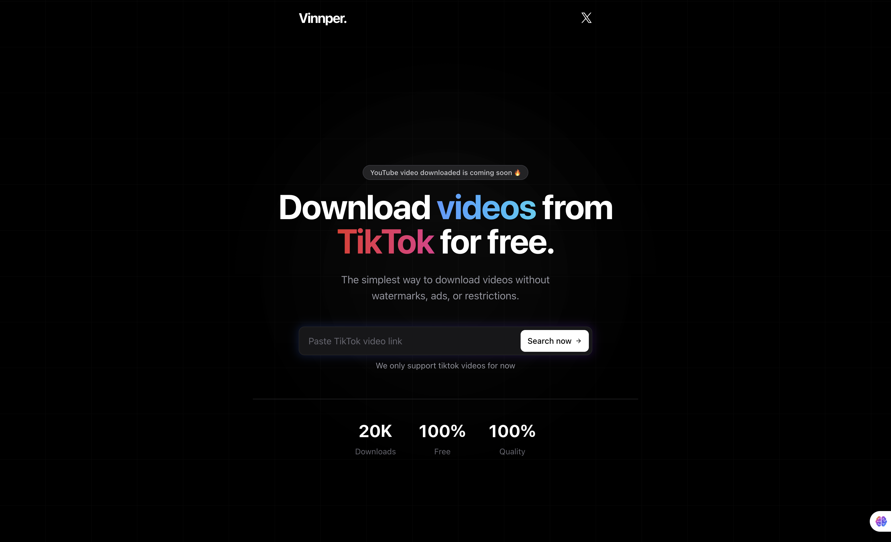

# Vinnper

<div align="center">
  
  <p><strong>Download TikTok and YouTube videos without watermarks - completely free!</strong></p>
</div>

## 🚀 Overview

Vinnper is a web application that lets users download TikTok and YouTube videos without watermarks. Built with Next.js and modern web technologies, Vinnper provides a seamless, user-friendly experience for saving your favorite content in high quality.

## ✨ Features

- **Watermark-Free Downloads**: Donwload videos without any platform branding
- **Multi-Platform Support**: Download from TikTok and YouTube
- **High-Definition Quality**: Preserve the original resolution of your content
- **Responsive Design**: Works perfectly on desktop and mobile devices
- **Zero Cost**: Completely free with no hidden fees or premium tiers

## 🛠️ Tech Stack

- **Frontend**: Next.js, React, TypeScript
- **Styling**: Tailwind CSS

## 🚀 Getting Started

### Prerequisites

- Node.js 20.x or later
- npm or yarn

### Installation

1. Clone the repository

```bash
git clone https://github.com/ajagatobby/vinnper.git
cd vinnper
```

2. Install dependencies

```bash
npm install
# or
yarn install
```

3. Start the development server

```bash
npm run dev
# or
yarn dev
```

4. Open [http://localhost:3000](http://localhost:3000) in your browser

## 🔧 Environment Variables

Create a `.env.local` file in the root directory and add the following variables:

```
NEXT_PUBLIC_API_URL=your_api_url
# Add any other required environment variables
```

## 📝 Usage

1. Visit the Vinnper website
2. Paste the URL of the TikTok or YouTube video you want to download
3. Click the download button
4. Select your preferred quality
5. Save the video to your device

## 🤝 Contributing

Contributions are welcome! Please feel free to submit a Pull Request.

1. Fork the repository
2. Create your feature branch (`git checkout -b feature/amazing-feature`)
3. Commit your changes (`git commit -m 'Add some amazing feature'`)
4. Push to the branch (`git push origin feature/amazing-feature`)
5. Open a Pull Request

## 📜 License

This project is licensed under the MIT License - see the [LICENSE](LICENSE) file for details.

## 🙏 Acknowledgements

- [Next.js](https://nextjs.org/)
- [Tailwind CSS](https://tailwindcss.com/)
- [Vercel](https://vercel.com/)
- [Sonner](https://sonner.emilkowal.ski/)
- [Geist Font](https://vercel.com/font)

## 📧 Contact

For questions or support, please reach out to us on [Twitter/X](https://x.com/ajaga_abdbasit).

---

<div align="center">
  <p>Made with ❤️ by Abdbasit Ajaga</p>
</div>
